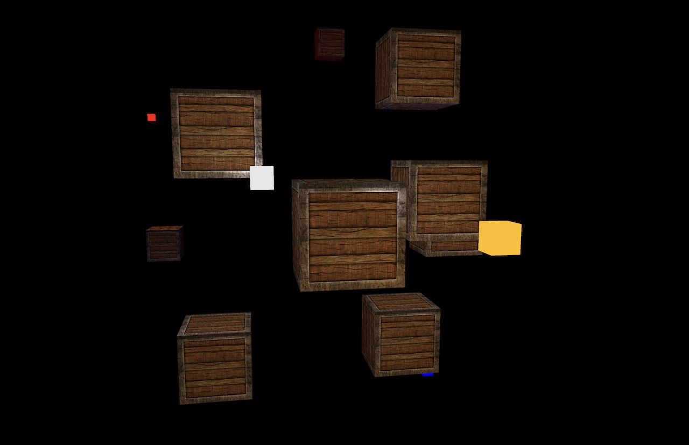

# Squirrel

Squirrel is a project is to facilitate experimentation with WGPU and how gameplay
could be implemented in Rust. It's messy, adhoc, full of TODO notes and not in any way
ready for production use.

If you see any obvious errors _please_ let me know by opening an issue!

# Running
## Windows/Mac/Linux desktop
Nothing special is required for running on traditional desktop machines. [Install
Rust](https://www.rust-lang.org/tools/install) on your machine and then type the
following commands in your terminal:

```
$ cargo build
$ cargo run
```

## Web assembly
To build this project for web assembly perform the following steps:
```
$ cargo install wasm-pack
$ python3 -m pygametools.web_build
```

Once built you will need to set up a web server that is pointed to the `pkg`
subfolder. Developers can make use of a builtin server for testing by passing
`-i` to the `pygametools.web_build` script:

```
$ python3 -m pygametools.web_build -i 
```

Open up your web browser to `http://localhost:9000` and you should see the
demo scene!

# Demos
## Input bindings
- `c` to swap between an arcball camera controller and a freelook (FPS) camera controller.
- `z` to toggle the depth buffer visualizer.